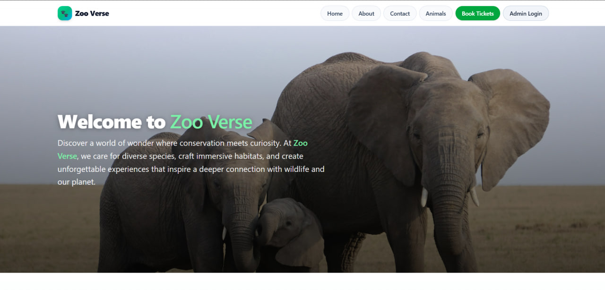

<p align="center">
  
</p>

<h1 align="center">
  <a href="https://zms.chaipecharcha.tech/" target="_blank" rel="noopener noreferrer">
    Zoo Verse — Zoo Management System
  </a>
</h1>

<p align="center">
  <b>A full‑stack zoo management & ticketing platform</b><br/>
  Manage animals, admins, orders, messages & scheduled visits with role‑based access control.
</p>

---

## 🚀 Features

- **Animals catalogue**: Public listing & detailed view with images
- **Ticket ordering**: Create orders with visit date & slot (morning / afternoon / evening)
- **QR ticket flow (planned)**: Generate & verify QR codes when orders are marked paid
- **Admin dashboard**: KPIs (orders, revenue placeholder, animals)
- **Messages inbox**: Public contact form → admin triage (read / archive / delete)
- **RBAC**: Roles `owner`, `admin`, `editor` with fine‑grained UI + API gating
- **Admins management**: Create (owner), edit, deactivate, delete (owner)
- **Animals CRUD**: Secure file uploads (Multer + optional Cloudinary)
- **Orders management**: Table/list views, status transitions (pending → paid)
- **Responsive UI**: Built with React + Tailwind
- **Environment ready**: Configurable via `.env` for API + Cloudinary

---

## 🧰 Tech Stack

### Frontend

- React + Vite
- React Router
- Tailwind CSS
- Zustand (domain stores: auth, animals, orders, admins, messages)
- React Hot Toast (feedback)

### Backend

- Node.js + Express
- MongoDB + Mongoose
- JWT auth (access + refresh cookies)
- Multer (file uploads) + optional Cloudinary
- QRCode (planned integration on payment success)

### Tooling & Deployment

- Vercel (frontend) _(or any static host)_
- Heroku / Node host (backend)
- Postman collection for API testing

---

## 🌐 Live & Demo

- **Live App:** https://zms.chaipecharcha.tech/
- **Backend:** https://zms-backend-cc1f6d375234.herokuapp.com/
- **Demo Video:** https://youtu.be/N60zMG09a_s

---

## 🛣️ Roadmap Snapshot

| Area                         | Status                  |
| ---------------------------- | ----------------------- |
| Auth & RBAC                  | ✅ (owner/admin/editor) |
| Admin CRUD                   | ✅                      |
| Animals Public View          | ✅                      |
| Animals CRUD (RBAC)          | ✅                      |
| Orders (create/list/status)  | ✅                      |
| Visit date & slot scheduling | ✅                      |
| QR ticket generation         | ⏳ Planned              |
| Payments provider (Razorpay) | ⏳ Pending credentials  |
| Webhook payment update       | ⏳ Planned              |
| Automated tests              | ⏳ Planned              |

---

## 📦 Project Structure

```
backend/
  src/
    controllers/   # REST handlers
    routes/        # Express routing layer
    models/        # Mongoose schemas
    middlewares/   # Auth, RBAC, multer
    utils/         # ApiResponse, ApiError, asyncHandler, cloudinary
    db/            # Mongo connection
  package.json
frontend/
  src/
    pages/         # Route views (public + admin)
    components/    # Reusable UI
    store/         # Zustand stores
    utils/         # API client
  public/          # Static assets & images
  package.json
CONTRIBUTING.md
README.md
```

---

## 🔐 RBAC Overview

| Role   | Capabilities (summary)                                      |
| ------ | ----------------------------------------------------------- |
| owner  | Full control; manage roles & delete admins                  |
| admin  | Manage animals, orders, messages, admins (except owner ops) |
| editor | Edit animal textual data (no image upload/delete)           |

RBAC enforced both server‑side (`requireAdminRole`) & client‑side (`PERMISSIONS` map in `useAdminsStore`).

---

## 📡 Key API Endpoints (prefix `/api`)

| Domain             | Methods                                                                                                                                                                                               |
| ------------------ | ----------------------------------------------------------------------------------------------------------------------------------------------------------------------------------------------------- |
| Auth/Admin         | `POST /admin/login`, `POST /admin/logout`, `POST /admin/refresh`, `GET /admin/me`, `POST /admin/register (owner)`, `GET /admin/admins`, `PATCH /admin/admins/:id`, `DELETE /admin/admins/:id (owner)` |
| Animals            | `GET /animals`, `GET /animals/:id`, `POST /animals`, `PATCH /animals/:id`, `DELETE /animals/:id`                                                                                                      |
| Messages           | `POST /messages`, `GET /messages`, `GET /messages/:id`, `PATCH /messages/:id`, `POST /messages/:id/read`, `POST /messages/:id/archive`, `DELETE /messages/:id`                                        |
| Orders             | `POST /orders`, `GET /orders`, `GET /orders/table`, `GET /orders/:id`, `PATCH /orders/:id`, `PATCH /orders/:id/status`, `GET /orders/verify?code=...`                                                 |
| Payments (planned) | `POST /payments/intent`, `POST /payments/razorpay/webhook`, `PATCH /payments/:id/simulate-success`                                                                                                    |

---

## 🧪 API Testing (Postman)

Import the provided collection:

1. Open Postman → Import → select `ZMS.postman_collection.json` (+ environment file if present)
2. Set `baseUrl` = `http://localhost:8000/api/v1` (or deployed API base)
3. Run `Admin / Login` → cookie auth persists automatically
4. Exercise animals, orders, messages, admins routes

> Admin routes rely on cookies. If manually using Bearer tokens, ensure headers align with backend expectations.

---

## 🧑‍💻 Local Development

### Prerequisites

- Node.js 18+
- MongoDB (local or Atlas)
- (Optional) Cloudinary account (image hosting)
- (Optional) Razorpay credentials (future payments)

### Clone & Install

```bash
git clone https://github.com/<your-fork>/zms.git
cd zms
cd backend && npm install
cd ../frontend && npm install
```

### Backend Environment (`backend/.env`)

```
MONGODB_URI=mongodb://localhost:27017/zms
ACCESS_TOKEN_SECRET=replace_with_strong_secret
REFRESH_TOKEN_SECRET=replace_with_strong_refresh_secret
ACCESS_TOKEN_EXPIRY=15m
REFRESH_TOKEN_EXPIRY=7d
CORS_ORIGIN=http://localhost:5173
CLOUDINARY_CLOUD_NAME=
CLOUDINARY_API_KEY=
CLOUDINARY_API_SECRET=
```

### Run (two terminals)

```bash
# Terminal A
cd backend
npm run dev

# Terminal B
cd frontend
npm run dev
```

Frontend: http://localhost:5173 | Backend: (configured port, e.g. 8000/5000)

---

## 🩺 Common Issues

| Issue                      | Fix                                                    |
| -------------------------- | ------------------------------------------------------ |
| 401 errors on public pages | Auth check restricted to `/admin` routes intentionally |
| Multer `Unexpected field`  | Ensure file field name is `image` in forms             |
| CORS blocked               | Set correct `CORS_ORIGIN` in backend `.env`            |
| Images not uploading       | Provide Cloudinary creds or fallback to local handling |
| Admin role change blocked  | Only `owner` can modify `owner` role or delete admins  |

---

## 🧾 Scripts (selected)

Backend:

```bash
npm run dev   # Start API (nodemon if configured)
```

Frontend:

```bash
npm run dev   # Vite dev server
npm run build # Production build
```

---

## 🤝 Contributing

Please see [`CONTRIBUTING.md`](./CONTRIBUTING.md) for full guidelines (branching, commits, PR checklist, RBAC notes).

Quick start:

1. Fork & clone
2. Create a feature branch (`feat/<something>`)
3. Commit using Conventional style
4. Open PR with screenshots / context

---

## 🗺️ Future Enhancements

- Razorpay integration + webhook → auto payment status
- QR ticket PDF/email delivery
- Analytics dashboard (charts)
- Automated test suite (Jest / Vitest)
- Soft delete & audit logs
- Image transformation & caching layer

---

## 📄 License

Distributed under the **MIT License**. See the [`LICENSE`](./LICENSE) file for full text.

---

## 🙌 Acknowledgements

- Inspiration: Need for streamlined zoo content & ticket scheduling
- Libraries & OSS community

---

> Built with care for learning and extensibility. Contributions welcome! 💚
