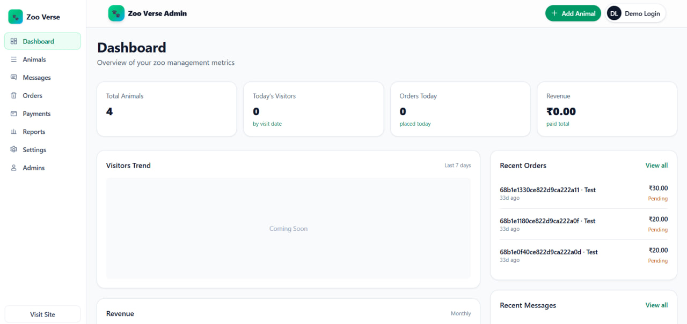

# ZMS — Zoo Management System (Zoo Verse)

<h1 align="center">
  
</h1>
<h1 align="center">
  
</h1>

## Demo Video

Watch a short walkthrough of the app:

- https://youtu.be/N60zMG09a_s

## Current Status

- Auth & RBAC (backend)

  - Roles: owner, admin, editor
  - JWT auth with access/refresh tokens
  - Admin endpoints:
    - POST /api/admin/register (owner only)
    - POST /api/admin/login, POST /api/admin/logout, POST /api/admin/refresh
    - GET /api/admin/me, PATCH /api/admin/me, PATCH /api/admin/me/password
    - GET /api/admin/admins (admin, owner)
    - PATCH /api/admin/admins/:id (admin, owner; changing roles or owner accounts requires owner)
    - DELETE /api/admin/admins/:id (owner only)
  - Middleware: verifyJWT, requireAdminRole(...)

- Admins management (frontend)

  - Store: src/store/useAdminsStore.js
    - Permissions matrix for RBAC
    - fetchAdmins, registerAdmin, updateAdmin, deleteAdmin
    - Status normalization (active | isActive | status)
  - Page: /admin/dashboard/admins
    - Lists admins, sorted by role: Owner, Admin, Editor
    - Create (owner), Edit (admin/owner), Delete (owner)
    - Search and basic paging count
  - Title: visiting any /admin/dashboard route sets document title to "Admin Dashboard"

- Payments/Orders (frontend)

  - Payments page shows only Pending and Paid orders, with local actions (mark paid/refund/delete) using useOrderStore
  - Reports and Dashboard fetch orders (for KPIs) and animals (for counts)

- Animals

  - Public GET /api/animals implemented; other CRUD protected by RBAC (to be filled as needed)

- Docs and setup below remain valid; see TODOs for gaps.

## Tech Stack

- Frontend: React, React Router, Tailwind CSS, Vite
- Backend: Node.js, Express, MongoDB (Mongoose), JWT (admin auth), Multer, Cloudinary, QRCode, Razorpay (optional)
- Deployment: Any Node host (Express serves API; frontend can be served by a static server with SPA fallback)

## Monorepo Structure

- frontend/ — React SPA (Vite). In production build, JS is bundled/minified.
- backend/ — REST API (Express + Mongoose), secured admin endpoints, webhooks.

## Features

- Public
  - Animals listing and detail
  - Contact form (submits a Message)
  - Ticket purchase flow
    - Create Order (public, status=pending)
    - Payment: cash (demo) or Razorpay (optional)
    - QR code tickets issued on payment success
    - Public verify endpoint to scan/validate tickets
- Admin
  - Admin authentication (JWT access/refresh)
  - Role-based access control: owner, admin, editor
  - Admins management: list, create (owner), edit, delete (owner)
  - Animals CRUD with optional image upload (Multer + Cloudinary)
  - Orders: list, table view, status updates to paid (QR generation)
  - Messages inbox: list, detail, update (status/assignee), mark read, archive, delete

## Demo & API Testing

### Postman Collection

A Postman collection is included to test the API quickly.

- Files:

  - ZMS.postman_collection.json
  - ZMS.postman_environment.json (optional)

- How to use:

  1. Open Postman and click Import.
  2. Import the collection JSON (and the environment if provided).
  3. Set baseUrl in environment to your API origin, e.g. http://localhost:8000/api/v1.
  4. Use the Admin -> Login request to authenticate; enable cookie persistence so Postman stores auth cookies.
  5. Run admin lists/CRUD, animals, orders, and messages endpoints from the collection.

- Notes:
  - Admin routes rely on cookies (access/refresh tokens). If you test with Bearer tokens, also set the Authorization header as needed.

## Auth & RBAC

- verifyJWT attaches req.user with role
- requireAdminRole("owner" | "admin" | "editor") wraps protected routes
- Frontend gates via useAdminsStore PERMISSIONS:
  - admin.register — owner
  - admins.read — admin, owner
  - admins.update — admin, owner
  - admins.delete — owner
  - animals: create/update (admin, editor), upload images/delete (admin, owner)
  - orders: list/update (admin, owner), delete (owner)
  - account: update (admin, owner), password (owner, admin, editor)

## Key Endpoints (prefix /api)

- Admin: /admin/...
  - POST /admin/register (owner), POST /admin/login, POST /admin/logout, POST /admin/refresh
  - GET /admin/me, PATCH /admin/me, PATCH /admin/me/password
  - GET /admin/admins (admin, owner)
  - PATCH /admin/admins/:id (admin, owner; role/owner changes require owner)
  - DELETE /admin/admins/:id (owner)
- Animals:
  - GET /animals, GET /animals/:id
  - POST /animals, PATCH /animals/:id, DELETE /animals/:id (JWT + RBAC)
- Messages:
  - POST /messages (public, JSON)
  - GET /messages, GET /messages/:id, PATCH /messages/:id, POST /messages/:id/read, POST /messages/:id/archive, DELETE /messages/:id (JWT + RBAC)
- Orders:
  - POST /orders (public create; status=pending)
  - GET /orders, GET /orders/table, GET /orders/:id (JWT + RBAC)
  - PATCH /orders/:id, PATCH /orders/:id/status (paid => generates QR)
  - GET /orders/verify?code=... (public verify/scan)
- Payments (optional):
  - POST /payments/intent { orderId, provider: "cash"|"razorpay" }
  - POST /payments/razorpay/webhook
  - PATCH /payments/:id/simulate-success (JWT; dev helper)

## Frontend Integration

- App title: App.jsx sets document.title = "Admin Dashboard" on /admin/dashboard paths
- Admins page uses useAdminsStore for fetch/create/update/delete with RBAC gating
- Payments, Reports, Dashboard use useOrderStore/useAnimalStore hooks to load data
- Sorting: Admins page sorts by role: Owner → Admin → Editor

## Backend Setup

1. Environment (backend/.env)

- MONGODB_URI=...
- MONGODB_DB=zms
- ACCESS_TOKEN_SECRET=...
- REFRESH_TOKEN_SECRET=...
- ACCESS_TOKEN_EXPIRY=15m
- REFRESH_TOKEN_EXPIRY=7d
- CLOUDINARY_CLOUD_NAME=
- CLOUDINARY_API_KEY=
- CLOUDINARY_API_SECRET=
- CORS_ORIGIN=http://localhost:5173

2. Install and run (Windows PowerShell)

- cd backend && npm install && npm run dev

## Frontend Setup

- cd frontend && npm install && npm run dev

## TODOs

- Add Payment Method, because i have not access to Razorpay Credentials.
- Once i connect Payment method, then i'll make those controllers and then after someone places order so razorpay webhook will open and user can pay and then it will change the status of payment from pending to paid.
